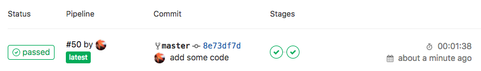
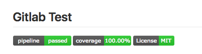

# Gitlab Test

[](http://gitlab.example/nyo/gitlab-test/commits/master)
[](http://gitlab.example/nyo/gitlab-test/commits/master)
[](https://img.shields.io/badge/License-MIT-brightgreen.svg)

test gitlab with CI/CD

## gitlab service

install gitlab in debian vm

- Vagrantfile at: [gitlab/Vagrantfile](gitlab/Vagrantfile)
- installation: https://about.gitlab.com/installation/#debian?version=ce
- this test gitlab host: http://gitlab.example

## gitlab runnter

- installation: https://docs.gitlab.com/runner/install/linux-repository.html
- register: https://docs.gitlab.com/runner/register/

### .gitlab-ci.yml with golang

```yml
image: golang:1.10

services:
    - redis:latest
    - mongo:latest
    - mariadb:latest

variables:
    REPO_PATH: gitlab.example/nyo/hello
    MYSQL_DATABASE: test
    MYSQL_ROOT_PASSWORD: test

before_script:
    - go version
    - go get -u github.com/Masterminds/glide

test-project:
    stage: test
    script:
        - mkdir -p $GOPATH/src/$REPO_PATH
        - mv $CI_PROJECT_DIR/* $GOPATH/src/$REPO_PATH
        - cd $GOPATH/src/$REPO_PATH
        - glide i
        - go test -v -coverprofile .testCoverage.txt

build-project:
    stage: build
    script:
        - go build -o hello
        - ./hello
```

if you need to set ssh keys: https://docs.gitlab.com/ce/ci/ssh_keys/README.html

### Demo

#### gitlab pipeline status



#### badge


